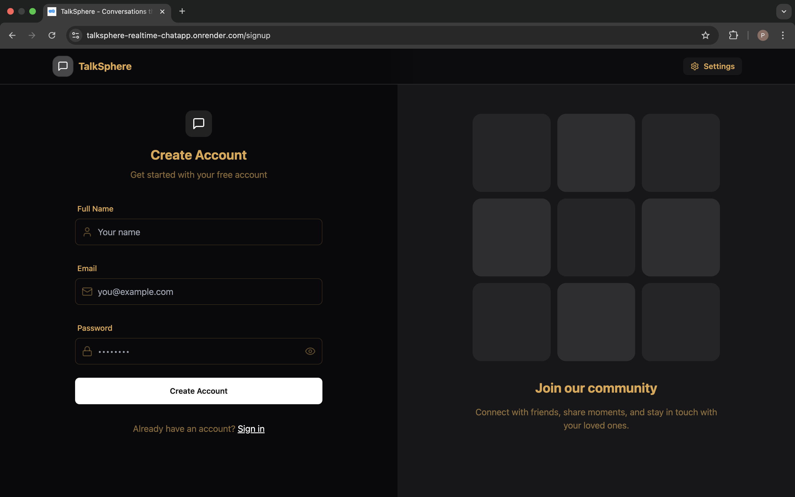

# 💬 TalkSphere - Realtime Chat App

🚀 A full-stack real-time chat application built with **React**, **Node.js**, **Socket.IO**, and **MongoDB**. Chat privately, stay connected, and experience lightning-fast messaging with a clean, modern UI.

---

## 🌐 Live Demo

👉 [TalkSphere is Live on Render](https://talksphere-realtime-chatapp.onrender.com)

---

## 📸 Preview

 <!-- Replace with your own screenshot -->

---

## ⚙️ Tech Stack

**Frontend**
- React
- Tailwind CSS
- DaisyUI
- Axios
- Vite

**Backend**
- Node.js
- Express.js
- MongoDB + Mongoose
- JWT Auth
- Socket.IO

**Others**
- Cloudinary (for image upload)
- Render (for deployment)
- dotenv

---

## 🔐 Features

✅ Real-time messaging (Socket.IO)  
✅ User Authentication (JWT + Cookies)  
✅ Online users indicator  
✅ Responsive, sleek UI with dark/light themes  
✅ Profile picture upload (Cloudinary)  
✅ Secure routes and session management  
✅ Fully deployed backend + frontend


### 🔐Setup .env file

```js
MONGODB_URI=...
PORT=5001
JWT_SECRET=...

CLOUDINARY_CLOUD_NAME=...
CLOUDINARY_API_KEY=...
CLOUDINARY_API_SECRET=...

NODE_ENV=development
```

### ⚙️Build the app

```shell
npm run build
```

### 🚀Start the app

```shell
npm start
```
